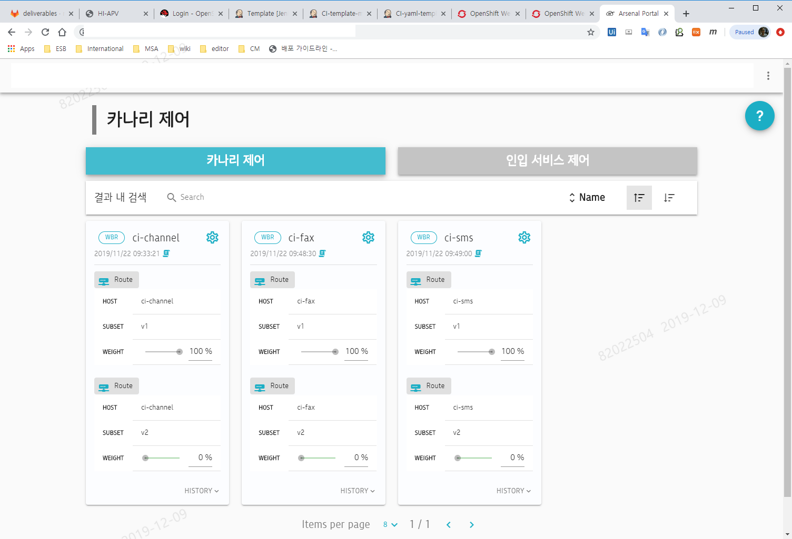
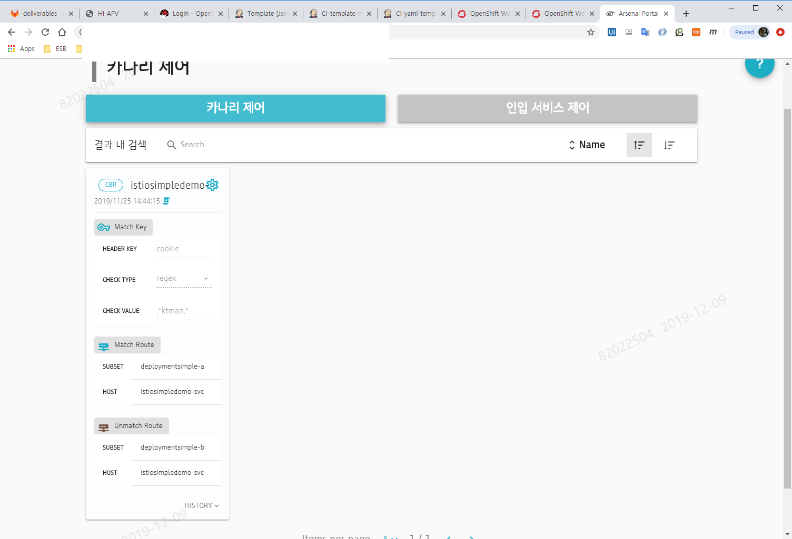

# Canary Deployment - Step by step guide

카나리 배포는 istio의 virtual service를 통해 구현이 되며, canary 의도에 맞게 deployment 등의 resouce 가 구성이 되어 있어야 한다.

**<Canary 배포 과정>**

# Canary deployment 구성 방법

- canary 배포에서 사용되는 virtual service의  routing 설정은 weight 설정으로 지정을 하는 방법과 header의 값에 따라 구성하는 방법으로 2가지 방법이 존재 한다.

- 본 가이드에서는 routing 설정에 따라 weight로 지정하는 방법은 **weight based canary deployment** , header의 값에 따라 routing 하는 방법은 **content based canary deployment** 라고 명명해서 설명 하겠다. 

  ## weight based canary deployment

  - 인입 트랜젝션을 weight 에 따라 분배하는 방법으로 weight 값에 따라 Transaction 이 비율로 분배 된다.

  - weight 값에 따라 트랜젝션이 달라지기 때문에 서비스의 정상여부를 로그등으로 모니터링 해야 한다.

    ### jenkins template

    ### 수행 방법

    

  ## content based canary deployment

  - 인입 트랜젠션을 header의 값에 따라 분배한다. 예를 들어 header의 cookie로 .\*man.\* 정규식이 맞는 경우 canary 로 보내게 설정할 경우 man 이란 데이터를 가진 cookie가 있는 경우 canary로 보낼 수 있다.

  - 일부 운영자나 일부 사용자 그룹등 미리 운영 상황에 맞게 설정된 사용자를 canary 환경에서 미리 테스트를 수행 할수 있다.

    ### Jenkins template

    ### 수행 방법

    

## Step0 - 기본 상태

- Deployment 가 기본 deployment 와 canary 로 구성이 되어 있다. 

- 기본 deployment 쪽 routing 하는 subset과 canary deployment쪽 routing 하는 subset은 식별이 가능하게 구성 해야 한다.

-  기본 deployment 만 replica 가 지정되어 서비스 되어 있고, routing 도 기본 deployment 에만 서비스 되도록 설정 된다.

  ### Step0 - Jenkins 설정

  

## Step1 - canary deployment version up

- canary deployment의 version 을 신규 버젼으로 배포를 수행 한다.

  ## Step1 - Jenkins 설정

## Step2 - replica 조정

- deployment 의 replica를 조정하여 운영 resource 기준에 맞게 설정 한다.

- 운영 자원이 충분 한 경우 기본 deployment의 replica는 줄일 필요는 없다.

- 수행후 pod의 정상 기동 여부를 확인하는 command를 수행하여 서비스 점검을 수행한다.

  ## Step2 - Jenkins 설정

## Step3 - virtual service routing rule 조정

- canary deployment 쪽의 서비스 점검이 완료 됐으니, virtual service를 조정해서 canary쪽으로 서비스 유입 되게 설정 한다.

- weight based canary 배포와 contents based canary 배포는 이 부분이 서로 다르다.

  ## Step3 - Jenkins 설정

## Test

- canary 쪽 설정이 완료 됐으므로 서비스가 정상인지 UI를 통해 확인한다.

- weight based canary는 canary deployment 의 로그 및 처리 현황을 모니터링 한다.

- content based canary는 header를 canary쪽으로 설정한 UI를 통해 확인한다.

- arsenal dev portal 을 통해 제어가 가능 하다.

  **<wbr canary-arsenal portal sample>**

  

  **<cbr canary - arsenal portal sample>**

  

  

## 완료 단계

- canary 배포가 끝났으면 yaml 배포로 신규 이미지를 배포한다.

- 기본 deployment 의 version이 신규 이미지로 변경 되고, yaml 에 저장된 정보로 resource 설정이 복원된다.

  